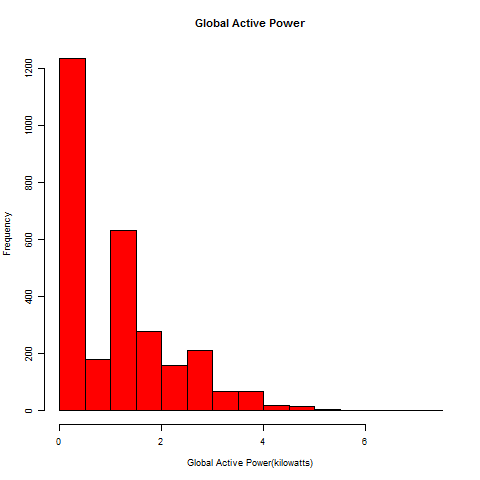
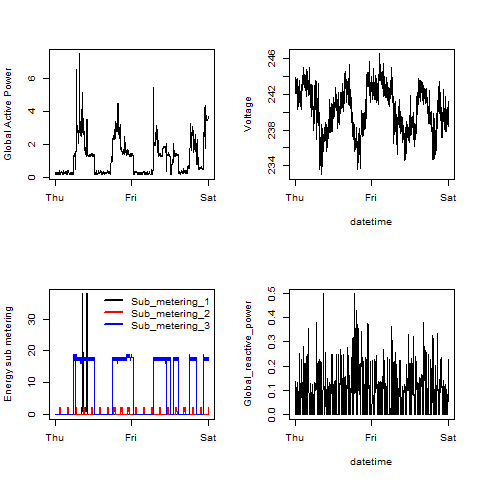

The scripts in this repository create the 4 plots, when the Electric power consumption dataset has been downloaded and extracted to the working directory (in R). 

These plots are PNG files with a width of 480 pixels and a height of 480 pixels named plot1.png, plot2.png, etc. and are shown below.

#### Plot 1

 
 

#### Plot 2

 

#### Plot 3

 

#### Plot 4

 

